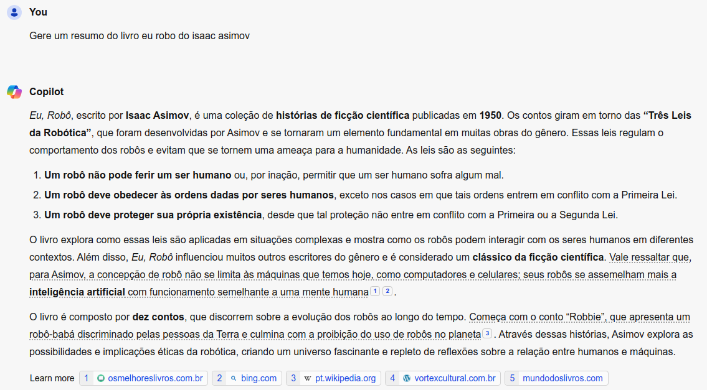
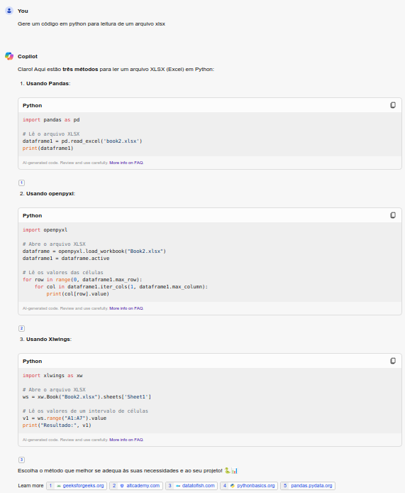
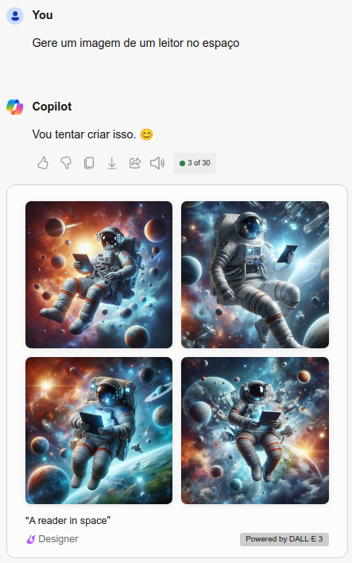

# dio-lab-azure-generative-ai
Repositório do desafio DIO - Explorando os Recursos de IA Generativa com Copilot e OpenAI

Neste projeto nos trabalhamos com a ferramenta de IA Generativa da OpenAI, o Copilot. O Copilot é uma ferramenta de geração de conteudo que utiliza a inteligência artificial para auxiliar na criação de textos, imagens e códigos.

## Passos para realização do desafio

- Utilizando o https://copilot.microsoft.com, nos podemos testar diversas funcionalidades como:
  - Geração de código
  - Geração de texto
  - Geração de imagens
- Especificando no prompt de comando o que queremos que o Copilot faça, ele nos retorna o resultado esperado.

### 1. Geração de texto

Apartir do prompt de comando, nos podemos especificar o que queremos que o Copilot faça. Por exemplo, se quisermos que ele nos retorne um texto sobre um determinado assunto, nos podemos especificar o assunto e o Copilot nos retornará um texto sobre o assunto especificado.

### 2. Geração de código

Podemos pedir ao Copilot para gerar um texto de código para uma determinada função ou método.

### 3. Geração de imagem

O Copilot também pode gerar imagens apartir de um prompt de comando. Por exemplo, se quisermos que o Copilot gere uma imagem de um gato, nos podemos especificar o comando e o Copilot nos retornará uma imagem de um gato.

